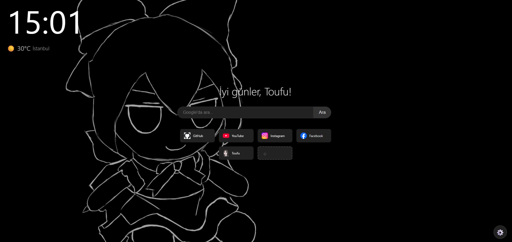

# toufu.homepage - Kişiselleştirilebilir Başlangıç Sayfası

toufu.homepage, tarayıcınızın her yeni sekmesini, ihtiyaçlarınıza göre şekillendirebileceğiniz, şık ve fonksiyonel bir başlangıç sayfasına dönüştüren bir tarayıcı eklentisidir. Güncel saati, hava durumunu, kişisel selamlama mesajını ve sık kullandığınız bağlantıları tek bir ekranda bir araya getirir.

## ✨ Özellikler

- **Dinamik Selamlama ve Saat:** Günün saatine göre değişen ("Günaydın", "İyi akşamlar" gibi) selamlama mesajları ve büyük, okunaklı bir dijital saat.
- **Gelişmiş Arama Çubuğu:**
  - Google, DuckDuckGo, Bing ve Yandex gibi popüler arama motorları arasında seçim yapma.
  - Arama yaparken otomatik tamamlama önerileri.
- **Anlık Hava Durumu:**
  - Belirlediğiniz konum için güncel hava durumu bilgisi.
  - Tıklandığında açılan 7 günlük detaylı hava tahmini.
- **Kişiselleştirilebilir Hızlı Bağlantılar:**
  - Sık kullandığınız siteleri kolayca ekleyin.
  - **Sağ Tık Menüsü:** Bağlantılara sağ tıklayarak açılan menüden hızlıca "Düzenle" ve "Sil" işlemlerini yapın.
  - **Sürükle ve Bırak:** Bağlantıları kolayca sürükleyerek yeniden düzenleyin.
- **Özelleştirilebilir Arka Plan:**
  - **Bing Günün Resmi:** Arka planı her gün otomatik olarak Bing'in resmiyle güncelleyin.
  - **URL:** İstediğiniz bir resim URL'sini arka plan olarak ayarlayın.
  - **Kendi Resimleriniz:** Bilgisayarınızdan resimler yükleyerek rastgele bir tanesinin gösterilmesini sağlayın.
- **Entegre RSS Okuyucu:**
  - İstediğiniz RSS akışlarını (tekli veya toplu) ekleyerek en son haberleri ve içerikleri takip edin.
  - Akışlar arasında sekmelerle kolayca geçiş yapın ve "Tümü" sekmesinde birleşik bir görünüm elde edin.
  - Sekmeleri sürükleyip bırakarak akış sırasını kişiselleştirin.
  - Performans için akış verileri otomatik olarak önbelleğe alınır.
- **Kullanıcı Dostu Ayarlar Paneli:** Tüm bu özellikleri tek bir yerden kolayca yönetin.

## 🚀 Kurulum

Bu eklentiyi tarayıcınızda yerel olarak çalıştırmak için aşağıdaki adımları izleyin:

1.  Bu repoyu bilgisayarınıza ZIP olarak indirin ve bir klasöre çıkartın.
2.  Kullandığınız tarayıcının (Chrome, Edge, Brave vb.) **Uzantılar** sayfasına gidin.
    - Chrome için: `chrome://extensions`
    - Edge için: `edge://extensions`
3.  Sağ üst köşedeki **"Geliştirici Modu"** (Developer Mode) seçeneğini etkinleştirin.
4.  **"Paketlenmemiş öğe yükle"** (Load unpacked) butonuna tıklayın.
5.  Açılan pencerede, 1. adımda dosyaları çıkarttığınız klasörü seçin.
6.  Eklenti yüklenecek ve yeni açtığınız her sekmede kişisel başlangıç sayfanız görünecektir.

## 🛠️ Kullanılan Teknolojiler ve Servisler
-**GEMINI** (Kodları yazarken Geminiden yardım aldım.)
- **HTML5**
- **CSS3**
- **Vanilla JavaScript** (Herhangi bir framework olmadan, saf JavaScript)
- **Sortable.js:** Sürükle-bırak işlevselliği için.

### Harici API'ler

- **Open-Meteo API:** Hava durumu verileri için kullanıldı.
- **Bing Image of the Day API:** Arka plan resmi için kullanıldı.
- **DuckDuckGo Autocomplete API:** Arama önerileri için kullanıldı.
- **Google S2 Favicon:** Hızlı bağlantıların ikonlarını çekmek için kullanıldı.
- **RSS2JSON API:** RSS akışlarını JSON formatına çevirmek için kullanıldı.

## 📄 Lisans

Bu proje GPL V3 Lisansı ile lisanslanmıştır. Detaylar için `LICENSE` dosyasına göz atabilirsiniz.